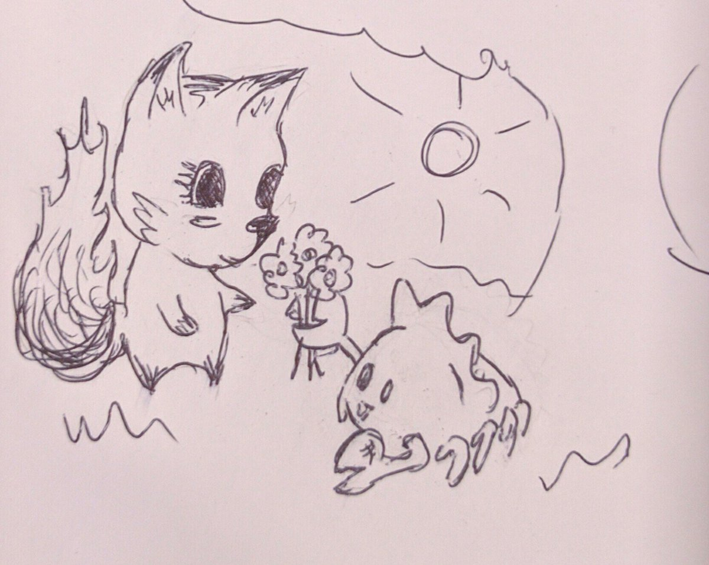

# learn rust

> A gentle introduction to the [Rust](https://www.rust-lang.org)
programming language, also referred to as rustlang.

  

[credit](https://twitter.com/qedunham/status/774293932263870464)

## learning resources

While this repository serves as an introduction to the language,
Rust has attracted a very friendly and open community that are
full of great resources. Below is a list of some personal recommendations.
Additions are welcome!

### places to start

* [The Rust Book](https://doc.rust-lang.org/book/) for a firm understand of the design goals and designs made to meet those goals in the language.
* [Rust By Example](http://rustbyexample.com/) a handle of practical examples to demonstrate common needs

### resources to follow

* [@rustlang](https://twitter.com/rustlang) the official language twitter account
* [@thisweekinrust](https://twitter.com/thisweekinrust) a weekly curation of notable happenings in the rust community
* [@oss_rust](https://twitter.com/oss_rust) an automated bot that services crates in the wild
* [rust rfcs](https://github.com/rust-lang/rfcs) changes that happen in Rust happen through community made debates and decisions

### accessing the community

* [/r/rust](https://www.reddit.com/r/rust)
* [stackoverflow](http://stackoverflow.com/questions/tagged/rust)
* [Rust nyc](https://www.meetup.com/rust-nyc/) IRL rustacians, right in your backyard

### conferences

* [Rustconf](http://rustconf.com/)
* [RustFest](http://rustfest.eu)
* [Rust Belt](http://www.rust-belt-rust.com/)

### presentations

* [youtube](https://www.youtube.com/playlist?list=PLE7tQUdRKcybLShxegjn0xyTTDJeYwEkI)
* [the end of unsafety](https://brson.github.io/the-end-of-unsafety/)
* [Speaker Deck](https://speakerdeck.com/search?utf8=%E2%9C%93&q=rust) bunch of things

## tools

* [cargo/crates.io](https://crates.io/) cargo is a build tool for rust, it is also a tool used for publishing "crates" to a central repository to facilitate and ecosystem of sharing. As of this time there's about a 1 in 8,943 chance of finding a crate to suit your needs
* [Rust Playpen](https://play.rust-lang.org/) play with Rust, without leaving your browser

## what's with the crab?

* That's [ferris](http://www.rustacean.net/), Rust's unofficial mascot
